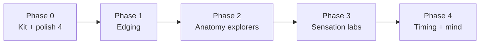

# Interactive Diagrams — Phased Generation Plan

**Status:** Phases 0–1 implemented; later phases are post-beta enhancements
**Why now:** Technique plates are acceptable but uninspiring; **explorable explanations** are the product differentiator (`animation_journey.md`, UI review § Skia diagrams).  
**Platforms:** iOS native — SwiftUI `Canvas` in `ConceptDiagrams.swift`
**Style:** Native diagram palette in `ios/Sources/PleasureVocabularyApp/AppTheme.swift` · plates remain reduce-motion posters only

---

## 1. Current state

| Concept | iOS (`ConceptDiagrams.swift`) | Interaction |
|---------|-------------------------------|-------------|
| Angling | ✅ native Canvas | **Pan** — drag pelvis, glow at posterior tuck |
| Rocking | ✅ native Canvas | **Pan** — partner wedge proximity heat |
| Shallowing | ✅ native Canvas | **Pan** — depth vs entrance intensity |
| Pairing | ✅ native Canvas | **Tap** — external + internal nodes, bridge glow |
| Edging | ✅ native Canvas | **Pan** — drag intensity up; release recedes |
| All others | illustration or video | — |

**Gaps today**

1. **Device evidence:** the five shipped diagrams still need gesture, Reduce Motion, VoiceOver, and small-screen QA.
2. **Future diagram types:** `types/index.ts` reserves `iceberg`, `nerve-density`, `cuv-complex`, and `warmup-window`, but the v2 bundle does not route them to native diagrams yet.
3. **Poster plates:** technique posters should harmonize with diagram tokens but are not the teaching moment—the diagram is.

---

## 2. Design principles (all new diagrams)

Borrow from completed prototypes (`docs/_archive/animation_journey.md` § III):

| Rule | Implementation |
|------|----------------|
| **Engine** | SwiftUI `Canvas` |
| **Canvas** | `conceptCanvas` `#F9F5F1`, 1px `neutral[200]` border, ~300pt height |
| **Strokes** | `diagram.passive` `#DCD8D3` anatomy · `diagram.active` `#E8603C` user/touch |
| **Glow** | `diagram.glow` `#FFC5B5` via blur layer — sensation only |
| **Mind split** | `diagram.detachment` `#7A7AFF` sparingly (spectatoring, non-concordance) |
| **Feedback** | Short label overlay (“Posterior tilt”, “Paired”) — lives in **UI chrome**, not in-image |
| **Reduce Motion** | Static “teaching frame” (sweet-spot pose), not auto-loop |
| **Caption** | Deck `illustrationCaption` below diagram — never burn text into canvas |
| **Mechanic** | One variable, one insight — user should learn in &lt;30s of play |

**Do not build:** multi-step tutorials, explicit anatomy realism, gamified scoring, or diagrams that duplicate video loops without adding manipulation.

---

## 3. Phased rollout



### Phase 0 — Diagram kit & polish existing four ✅

**Goal:** One shared foundation before new concepts.  
**Status:** Implemented in the native app (shared frame, touch gestures, token audit, haptics)
**Exit:** All four techniques pass native device QA on the See page.

Reduce Motion shows static teaching frames instead of requiring gesture-driven motion.

| Task | Deliverable |
|------|-------------|
| Extract shared frame | ✅ `DiagramFrame` in `ConceptDiagrams.swift` — canvas, border, height |
| Token audit | ✅ All paths use `AppColor.diagram*` |
| Interaction model | ✅ Native pan/tap gestures |
| Haptics | ✅ Light impact on angling sweet spot + pairing complete |
| Accessibility implementation | ✅ Labels derive from bundle media alt/caption; Reduce Motion has static frames |
| QA script | ✅ Diagram checks live in `ios/DEVICE_QA.md` |

**No new concepts.** Polish only.

---

### Phase 1 — Edging (format-locked interactive) ✅

**Goal:** First new diagram; validates the pipeline end-to-end.  
**Status:** Implemented in iOS and wired through the v2 bundle
**Concept:** `edging` · caption: *Intensity rising toward a threshold, then receding*

| Spec | Detail |
|------|--------|
| **Mechanic** | Vertical **throttle** — drag intensity up toward a coral threshold line; release drags back down (approach & retreat cycle) |
| **Visual** | Rising fill / wave height + glow; red-line = high arousal zone (coral, not alarm red); retreat fades glow |
| **Insight** | “Hovering near the edge then backing off” — tachometer metaphor without numeric labels |
| **Reduce motion** | Frozen frame at ~80% threshold with caption context |

**Engineering**

1. `EdgingDiagramView` in `ConceptDiagrams.swift`
2. `diagramType: 'edging'` in `vocabulary.ts` + `DiagramType` union
3. Bundle generation emits `native://diagram/edging`
4. `ConceptPages.swift` routes the native media item
5. `data/visual-formats.json` records `edging` as interactive
6. The illustration remains the static fallback

**Prompt / spec file:** `docs/pipelines/prompts/diagrams/edging.md` (interaction spec, not image gen)

---

### Phase 2 — Anatomy explorers

**Goal:** Replace uninspiring static anatomy plates with **layered exploration** on Illustrate.  
**Duration:** ~2 weeks  
**Priority order:** clitoral-structure → nerve-density → clitourethrovaginal → internal-stimulation

| Concept | `diagramType` | Mechanic | Teaches |
|---------|-------------|----------|---------|
| **Clitoral Structure** | `iceberg` | **Peel layers:** tap/slide to reveal external glans → bulbs → crura (iceberg cross-section) | Hidden 9cm structure |
| **Nerve Density** | `nerve-density` | **Density dial:** pinch or slider zooms into glans; nerve filaments multiply / brighten | 8k endings in small area |
| **CUV Complex** | `cuv-complex` | **Pressure triad:** three toggles (clitoral / urethral / anterior wall); overlap glow at shared zone | Integrated cluster, not a magic spot |
| **Internal Stimulation** | `internal-stimulation` | **Angle slider:** same pelvis metaphor as angling but focus on anterior-wall contact path | Front-wall ≠ deep |

**Notes**

- Plates + thumbs remain library/reduce-motion assets; diagrams are primary on Illustrate.  
- Consider **deferring** anatomy Omni videos for these four once diagrams ship (video = optional enhancement, not blocker).  
- Reuse angling pelvis math for internal-stimulation where possible.

**Exit:** Four anatomy See pages teach the intended relationship; bundle validation covers every native diagram reference.

---

### Phase 3 — Sensation labs

**Goal:** Manipulation beats passive loops for temporal/rhythm concepts.  
**Duration:** ~2 weeks  
**Order:** building → edging already done → plateauing → pulsing → spreading

| Concept | Mechanic | Relationship to video |
|---------|----------|----------------------|
| **Building** | **Hold to charge** — long-press fills reservoir; release leaks slightly | Video loop remains; diagram for engage mode |
| **Plateauing** | **Ridge walk** — drag dot along rising curve onto flat plateau; stays level until user changes | Replaces need for process-explainer video |
| **Pulsing** | **Rhythm tap** — tap in sync with 0.8s pulse rings; rings expand on beat | Video optional; diagram teaches frequency |
| **Spreading** | **Ripple tap** — tap origin, watch rings travel through nerve tree | Keep `spreading.mp4` as reduce-motion / ambient |

**Skip as interactive:** none required in Phase 3 beyond this list.

---

### Phase 4 — Timing & psychological pairs

**Goal:** Mind/body and time concepts users “feel” rather than read.  
**Duration:** ~2 weeks  
**Order:** warmup-window → responsive-desire + spontaneous-desire → spectatoring + embodied-presence → non-concordance

| Concept | Mechanic | Pairing |
|---------|----------|---------|
| **Warm-up Window** | **Slow cooker** — fast drags fill nothing; slow sustained drag fills engorgement bar | `warmup-window` already in `DiagramType` |
| **Responsive Desire** | **Ember rub** — dormant coal; only glows after sustained circular “context” gesture | Contrast ↓ |
| **Spontaneous Desire** | **Wellspring** — bubbles rise on timer without user touch | Contrast ↑ |
| **Spectatoring** | **Focus misalign** — ghost orb off-center; user drags to align with body (cool `#7A7AFF`) | Opposite ↓ |
| **Embodied Presence** | **Fill outline** — drag warmth into body silhouette until fully saturated | Opposite ↑ |
| **Non-concordance** | **Dual meter** — two bars (genital response vs felt desire); sliders uncorrelated | Static plate backup |

**Defer:** golden-trio (three-channel builder = high effort, low unique insight), sexual-self-esteem, body-appreciation (static OK).

---

## 4. Per-diagram delivery checklist

For each new interactive concept:

```
docs/pipelines/prompts/diagrams/{id}.md   ← interaction spec (mechanic, states, a11y)
ios/.../ConceptDiagrams.swift              ← {Id}DiagramView
types/index.ts                            ← DiagramType union
data/vocabulary.ts                        ← diagramType field
data/visual-formats.json                  ← format: interactive
scripts/generate-v2-full-bundle.js        ← native media routing
ios/DEVICE_QA.md                          ← device test rows
```

**Spec template** (`prompts/diagrams/{id}.md`):

```markdown
# {id} — Interactive diagram

**Caption:** {from vocabulary illustrate slide}
**Category:** {family}
**Mechanic:** {one sentence}
**States:** {idle → … → insight}
**Reduce motion:** {static frame description}
**Tokens:** passive / active / glow / detachment
**Do not:** {explicit content, in-canvas text, …}
```

---

## 5. Recommended execution order (sprints)

| Sprint | Ship | Rationale |
|--------|------|-----------|
| **S0** | Phase 0 polish | Cheap quality lift on existing wow-factor |
| **S1** | Edging | Format-locked; proves pipeline |
| **S2** | Clitoral Structure + Nerve Density | Anatomy is where static plates disappoint most |
| **S3** | CUV + Internal Stimulation | Completes anatomy family |
| **S4** | Building + Plateauing | Sensation pair, distinct mechanics |
| **S5** | Pulsing + Spreading | Rhythm + propagation |
| **S6** | Warm-up Window | Timing flagship |
| **S7** | Responsive + Spontaneous desire pair | Teaches contrast |
| **S8** | Spectatoring + Embodied Presence pair | Psychological flagship |
| **S9** | Non-concordance | Dual-meter capstone |

**Pause Batch B plate regen** at current acceptable state; resume only for concepts that **stay static** after their diagram ships.

---

## 6. Success criteria

| Metric | Target |
|--------|--------|
| Illustrate slide median time | ≥15s on interactive concepts (UI review metric) |
| Mechanic comprehension | User can describe concept in own words after 20s play (qualitative QA) |
| Reduce motion | Every interactive has meaningful static frame |
| Style | Diagram tokens match Style Bible §4; no palette drift vs plates |

---

## 7. Explicit non-goals

- Replace technique diagrams with video (locked in `VIDEO_CONCEPT_CATALOG.md`)
- Full 22/22 interactive coverage — ~14 interactives max in this plan
- 3D, Rive, or Lottie diagrams (SwiftUI Canvas only)
- In-diagram labels, numbers, or citation text
- Blocking ship on golden-trio builder or communication-toolkit interactives

---

## 8. Immediate next steps

1. **Device QA** — run gesture, Reduce Motion, VoiceOver, and small-screen checks for the five implemented diagrams.
2. **Keep Phases 2–4 deferred** until the Phase 7 product model and first TestFlight learning pass are complete.
3. **Resume with one anatomy slice**—Clitoral Structure—before spreading the pattern to the remaining planned diagrams.

---

*Related: `docs/_archive/animation_journey.md` · `docs/product/visual_content_strategy.md` · `ios/Sources/PleasureVocabularyApp/ConceptDiagrams.swift`*
